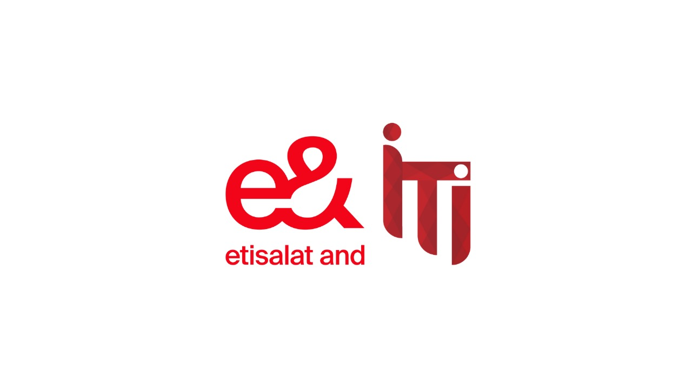

# GenAI Assistant Chatbot for e& Portal

An AI-powered assistant chatbot built for the **e& portal**, offering contextual and intelligent interaction by leveraging state-of-the-art techniques in large language model fine-tuning and optimization.

---

## 🔍 Overview

This project is part of our ITI graduation project. It aims to develop a **Generative AI-based assistant** for the e& website. The chatbot is designed to understand and respond to user queries intelligently by utilizing content dynamically scraped from the website.

---

## 🚀 Key Features

- 💬 Intelligent response generation using fine-tuned LLMs
- ⚙️ Model fine-tuning using:
  - LoRA / QLoRA
  - LLaMA Factory
  - PEFT (Parameter-Efficient Fine-Tuning)
  - Knowledge Distillation
- 🌐 Web scraping of the e& portal for live, page-specific content
- 💧 Data Watering for Continuously enriching the chatbot’s context with fresh content scraped from the e& portal, enabling up-to-date, page-specific responses without needing frequent re-training.

- 📚 Context-aware information retrieval from website data
- 🧠 Custom-trained models based on e& portal domain

---

## 🛠️ Tech Stack

- **LLaMA Factory** – Model training and instruction fine-tuning
- **Hugging Face Transformers** – Base LLMs and tokenizer support
- **PEFT / LoRA / QLoRA** – Efficient adaptation of LLMs
- **BeautifulSoup / Scrapy** – Web scraping tools
- **FastAPI / Gradio / Streamlit** (Planned) – For deploying and testing the assistant

---

## ✅ Progress Status

- [x] Set up environment and LLaMA Factory
- [x] Applied fine-tuning with LoRA and QLoRA
- [x] Tested PEFT integration
- [x] Scraping structured data from e& portal
- [ ] Knowledge integration into chatbot memory
- [ ] Final deployment via portal interface

---

## 📌 Goals

1. Build a chatbot that understands domain-specific queries related to e& services.
2. Integrate data scraping to make the bot page-aware and dynamic.
3. Optimize for cost and performance using PEFT and distillation techniques.
4. Create an intuitive and accessible interface for deployment.

---

## 👥 Team

This project is being developed by ITI students as part of the graduation requirement. More contributor details will be added soon.

---

## 📄 License

This project is currently under development and internal use. License details will be updated prior to public release.

---

## 📬 Contact

For collaboration or inquiries, please reach out via the Issues tab or contact us at: `m.mohyy.ai@gmail.com`
